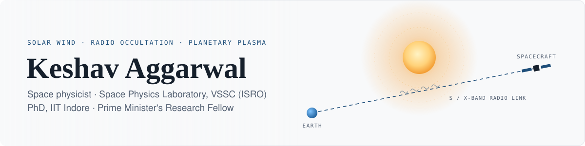

<a href="https://jovian-explorer.github.io/">
  <picture>
    <source media="(prefers-color-scheme: dark)" srcset="assets/banner-dark.svg">
    
  </picture>
</a>

  
  <!-- auto:scholar-badge -->

<!-- /auto:scholar-badge -->
  
  
   
  
  
  
  

## About

I am a space physicist working at the intersection of **radio science, planetary science, space weather and data-driven research**. I use spacecraft radio signals to study the solar corona, the solar wind, interplanetary plasma and planetary ionospheres. With observations from the **Indian Mars Orbiter Mission, Chandrayaan-2, Chandrayaan-3, Akatsuki and Venus Express**, I apply signal and time-series analysis to measure solar-wind speed, coronal electron density, plasma turbulence and the effects of space weather on planetary environments.

I submitted my PhD thesis, *Exploring Space Weather and Its Effect on Planetary Atmospheres Using Radio Occultation*, at **IIT Indore** in May 2026, supervised by [Prof. Abhirup Datta](https://sites.google.com/iiti.ac.in/abhirupdatta/) and supported by the [Prime Minister's Research Fellowship](https://pmrf.in). I am now a student visitor at the **Space Physics Laboratory, Vikram Sarabhai Space Centre (ISRO)**, Thiruvananthapuram.

Before that I built AI/ML and orbital-mechanics algorithms at ERETS Space London, and data pipelines for space-debris analysis at Armstrong Space Australia. That work pulled me towards space situational awareness, scientific software and making complex datasets easier to use.

## At a glance

<!-- auto:glance -->
<table>
  <tr>
    <td align="center" width="16%"><h3>2,078</h3>citations</td>
    <td align="center" width="16%"><h3>9</h3>h-index</td>
    <td align="center" width="16%"><h3>26</h3>publications</td>
    <td align="center" width="16%"><h3>8</h3>first-author papers</td>
    <td align="center" width="16%"><h3>15</h3>talks &amp; posters</td>
    <td align="center" width="16%"><h3>31</h3>outreach videos</td>
  </tr>
</table>
<!-- /auto:glance -->

## Honours

| | | |
|:--|:--|:--|
| 🏅 **Prime Minister's Research Fellowship** | Ministry of Education, Government of India | Jul 2023 |
| 🏆 **Early Career Researcher Award, best poster** | 6th Indian Planetary Science Conference, IIT Roorkee | Mar 2025 |
| ✈️ **AGU Student Grant** | AGU Fall Meeting 2025, New Orleans | Dec 2025 |
| 🛰️ **ISpA Affiliate Member** | [Indian Space Association](https://ispa.space/) | Feb 2026 |

## Research

| | Theme | What I do | Papers |
|:--:|:--|:--|:--|
| ☀️ | **Solar wind and corona** | Solar-wind speed and coronal density from the spectral broadening of spacecraft radio signals near solar conjunction (MOM S-band, Akatsuki X-band, across solar-activity levels). A turbulence-index-independent framework and a generalised Kolmogorov retrieval. | [ApJ 2025](https://doi.org/10.3847/1538-4357/adb627) · [MNRAS 2025](https://doi.org/10.1093/mnras/staf1305) · [MNRAS 2026](https://doi.org/10.1093/mnras/stag554) · [ASR 2026](https://doi.org/10.1016/j.asr.2026.03.059) |
| 🌌 | **Interplanetary medium** | Separating the interplanetary contribution from planetary radio-occultation signals using Chandrayaan-2, Chandrayaan-3, Venus Express and Akatsuki data. | [Icarus 2026](https://doi.org/10.1016/j.icarus.2026.117291) |
| 🌕 | **Lunar plasma environment** | Electron-density turbulence around the Moon from Chandrayaan-2 two-way radio science, comparing the solar wind with the terrestrial magnetotail. | [JGR: Planets 2026](https://doi.org/10.1029/2026JE009957) |
| 🪐 | **Exoplanet atmospheres** | Member of the JWST Transiting Exoplanet Community ERS team: first JWST spectra of WASP-39b (CO₂, CO, photochemical SO₂), WASP-18b and WASP-43b. | [Nature 2023](https://doi.org/10.1038/s41586-022-05269-w) · [Nature 2023](https://doi.org/10.1038/s41586-023-05902-2) · [Nature 2024](https://doi.org/10.1038/s41586-024-07040-9) · [+6 more](https://jovian-explorer.github.io/publications.html) |
| 🔭 | **Mission concepts** | Co-author on three white papers for the 2024–2033 Heliophysics Decadal Survey, including the COMPLETE flagship concept. | [BAAS 55(3)](https://jovian-explorer.github.io/publications.html) |

### Missions and data

| Mission | Agency | Radio link | Use |
|:--|:--|:--|:--|
| Mars Orbiter Mission | ISRO | S-band | Coronal radio sounding at solar conjunction |
| Akatsuki | JAXA | X-band, one-way | Solar-wind speed across solar-activity levels; interplanetary baseline |
| Chandrayaan-2 | ISRO | S-band, two-way | Lunar plasma turbulence; lunar occultations |
| Chandrayaan-3 | ISRO | S-band, two-way | Interplanetary fluctuations outside the lunar ionosphere |
| Venus Express | ESA | S/X-band, one-way | Interplanetary-only baseline |

## Software

<table>
  <tr>
    <td width="33%" valign="top">
      <h3><a href="https://github.com/jovian-explorer/VEDA">VEDA</a></h3>
        
      Multi-mission planetary science laboratory: finds, downloads, processes and compares observations from NASA, ESA, JAXA and ISRO missions across the planets.  
      Python · Windows, macOS, Linux
    </td>
    <td width="33%" valign="top">
      <h3>COSMIC2 Explorer</h3>
        
      Desktop environment for COSMIC-2 GNSS radio-occultation profiles: retrieval, tropopause and ionosphere diagnostics, and comparison with other planetary atmospheres. Works offline.  
      Python · Windows, macOS, Linux
    </td>
    <td width="33%" valign="top">
      <h3>HELIOS-L1</h3>
        
      Space-weather suite for the Sun–Earth L1 fleet (DSCOVR, ACE, Aditya-L1, WIND, SOHO): solar-wind coupling, magnetopause and storm models, CME arrival estimates.  
      Python · Windows, macOS, Linux
    </td>
  </tr>
</table>

**Released code:**
[RO-SPICE](https://github.com/jovian-explorer/RO-SPICE) (radio-occultation geometry with NASA SPICE) ·
[Akatsuki_open](https://github.com/jovian-explorer/Akatsuki_open) (Akatsuki open radio-science pre-processing) ·
[Sun](https://github.com/jovian-explorer/Sun) (MOM solar-wind speeds, ApJ 2025) ·
[CO₂ in WASP-39b](https://github.com/jovian-explorer/Identification-of-carbon-dioxide-in-an-exoplanet-atmosphere) (figures for Nature 2023)

**Toolbox**

  
  
  
  
  
  
  
  
  
  

## Selected first-author papers

<!-- auto:papers -->
- **A study on the contribution of the interplanetary medium in radio occultation experiments**, *Icarus* (2026). [doi](https://doi.org/10.1016/j.icarus.2026.117291)
- **Plasma turbulence in the lunar environment across solar wind and magnetotail conditions: Observations from Chandrayaan-2 Radio Science experiment**, *JGR: Planets* (2026). [doi](https://doi.org/10.1029/2026JE009957)
- **A turbulence index independent framework for deriving solar wind speed and coronal electron density from radio spectral broadening**, *MNRAS* (2026). [doi](https://doi.org/10.1093/mnras/stag554)
- **A generalized method for estimating solar wind speeds and densities using spectral broadening for a Kolmogorov turbulence spectrum**, *Advances in Space Research* (2026). [doi](https://doi.org/10.1016/j.asr.2026.03.059)
- **On the estimation of solar wind velocity under varying solar activity conditions using Akatsuki measurements**, *MNRAS* (2025). [doi](https://doi.org/10.1093/mnras/staf1305)
- **Insights into solar wind flow speeds from the coronal radio occultation experiment: Findings from the Indian Mars Orbiter Mission**, *ApJ* (2025). [doi](https://doi.org/10.3847/1538-4357/adb627)
<!-- /auto:papers -->

➡️ Full list with search and filters: **[jovian-explorer.github.io/publications](https://jovian-explorer.github.io/publications.html)**

## Recent talks and posters

<!-- auto:talks -->
| When | Event | Where |
|:--|:--|:--|
| Mar 2026 | 🎤 7th Indian Planetary Science Conference (IPSC 2026) | IIT Indore |
| Feb 2026 | 🎤 National Space Science Symposium (NSSS 2026) | Umiam, Shillong |
| Jan 2026 | 🖼️ ISRO–ESA Workshop | Thiruvananthapuram |
| Dec 2025 | 🖼️ AGU Fall Meeting 2025 · *AGU Student Grant* | New Orleans, United States |
| Dec 2025 | 🖼️ The Variable Sun | Thiruvananthapuram |
| Sep 2025 | 🖼️ ASI Symposium 003, Astronomical Society of India | JECRC University, Jaipur |
<!-- /auto:talks -->

🎤 talk · 🖼️ poster · all of them on the [talks page](https://jovian-explorer.github.io/talks.html)

## Latest videos and writing

<!-- auto:latest -->
| 📺 Latest videos | ✍️ Latest articles |
|:--|:--|
| [Plasma Turbulence in Lunar Environment During Magnetotail Passage: Observations from Chandrayaan-2](https://www.youtube.com/watch?v=0qbrOB-qnnA) Sep 2026 | [Is it Life, or is it Volcanoes?](https://jovian-explorer.medium.com/is-it-life-or-is-it-volcanoes-315a89fd4154) Oct 2023 |
| [A study on the contribution of the interplanetary medium in radio occultation experiments](https://www.youtube.com/watch?v=Ex9r_Qzf1Dc) Sep 2026 | [India’s Lunar Triumphs and Solar Aspirations](https://jovian-explorer.medium.com/indias-lunar-triumphs-and-solar-aspirations-cf4ba64d957d) Oct 2023 |
| [A turbulence index independent framework for deriving solar wind speed and coronal electron density](https://www.youtube.com/watch?v=BUyCingJDiM) Sep 2026 | [OSIRIS-REx: A complete guide to the asteroid-sampling mission](https://jovian-explorer.medium.com/osiris-rex-a-complete-guide-to-the-asteroid-sampling-mission-74331f5997bd) Sep 2023 |
<!-- /auto:latest -->

## In the media

- [Probing the solar wind with spacecraft radio occultation signals](https://blogs.egu.eu/divisions/st/2026/02/01/probing-the-solar-wind-with-spacecraft-radio-occultation-signals-chasing-a-unified-method-to-probe-the-sun/), *EGU Blogs* (Feb 2026)
- [Insights into solar wind flow speeds from the Indian Mars Orbiter Mission](https://thesciencearchive.org/2502-09512v1/), *The Science Archive* (Feb 2025)
- [New breakthrough on solar wind unveiled by India's Mars Orbiter Mission](https://newwaveparticle.com/new-breakthrough-on-solar-wind-unveiled-by-indias-mars-orbiter-mission-mom/), *New Wave Particle* (2025)

## Beyond research

- 🔭 **[Outreach](https://jovian-explorer.github.io/outreach.html):** public astronomy events, 31 lab videos and 12 classroom documents in English and Hindi, made with fellow students at IIT Indore
- 📺 **[YouTube](https://jovian-explorer.github.io/videos.html)** and ✍️ **[Medium](https://jovian-explorer.github.io/writing.html):** short explainers of my papers and space missions
- 📷 **[Photography](https://jovian-explorer.github.io/photography.html)** and 🗺️ **[travel](https://jovian-explorer.github.io/travel.html):** albums and maps from conferences and trips

---

  <a href="https://jovian-explorer.github.io/"><b>jovian-explorer.github.io</b></a> ·
  <a href="https://jovian-explorer.github.io/cv.html">CV</a> ·
  <a href="https://jovian-explorer.github.io/research.html">Research</a> ·
  <a href="https://jovian-explorer.github.io/publications.html">Publications</a> ·
  <a href="https://jovian-explorer.github.io/software.html">Software</a> ·
  <a href="https://jovian-explorer.github.io/talks.html">Talks</a>

<!-- auto:updated -->
Numbers and lists refresh weekly from <a href="https://jovian-explorer.github.io/">jovian-explorer.github.io</a>. Citations from Google Scholar, Oct 2026.
<!-- /auto:updated -->

